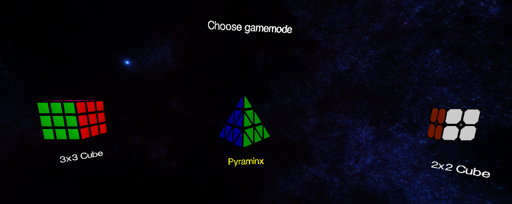
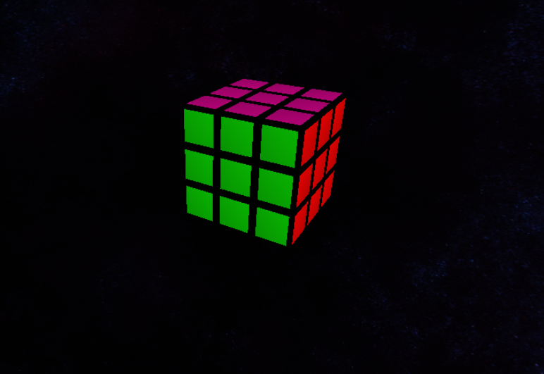
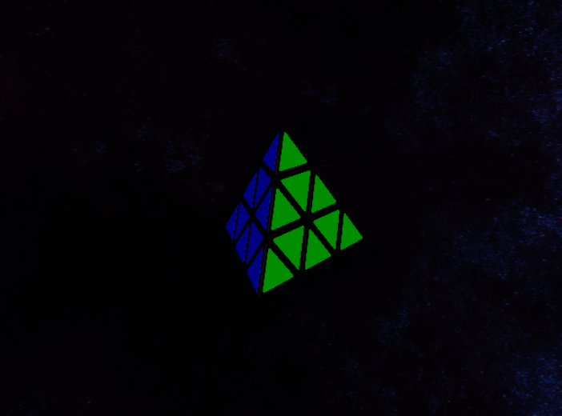
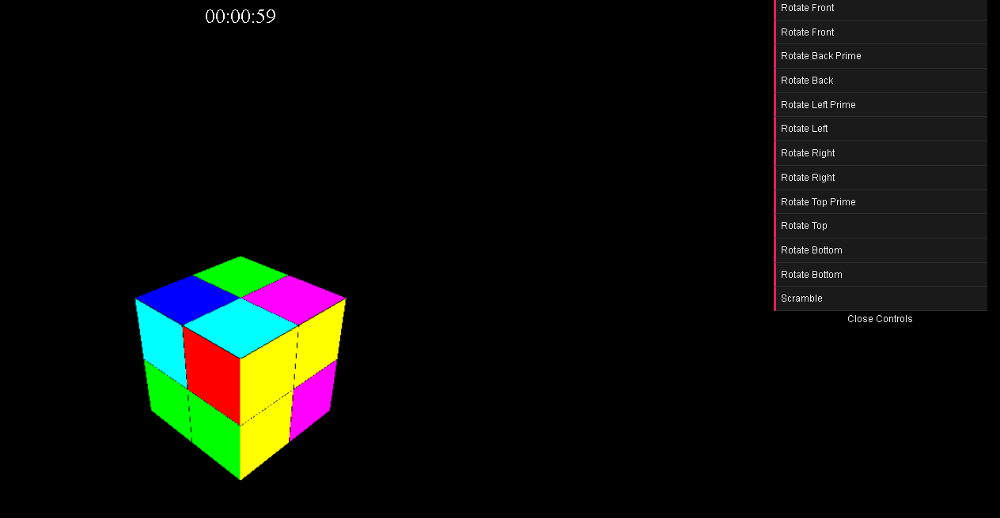

# 🎲 Interactive Rubik's Cube & Pyraminx Simulator

An interactive web application showcasing 3D models of Rubik's Cubes and Pyraminx puzzles, built with Three.js for immersive 3D rendering and user interaction.

---

## 🚀 How to Run the Project

### Prerequisites
- Node.js (v14 or higher)
- npm or yarn package manager

### Installation & Setup

1. **Clone the repository**
   ```bash
   git clone https://github.com/yourusername/interactive-rubiks-cube.git
   cd interactive-rubiks-cube
   ```

2. **Install dependencies**
   ```bash
   # Install Three.js
   npm install --save three
   
   # Install Vite for development
   npm install --save-dev vite
   ```

3. **Download required textures**
   
   Download the galaxy texture from [Sketchfab](https://sketchfab.com/3d-models/inside-galaxy-skybox-hdri-360-panorama-96183eed1ae2425baddb75ca92103f87)
   
   Place it in `./textures/` and rename to `Galaxy_texture`

4. **Run the development server**
   ```bash
   npx vite
   ```

5. **Open your browser**
   
   Navigate to `http://localhost:5173` (or the port shown in your terminal)

---

## ✨ Features

- **🌌 Immersive 3D Environment** - Galaxy skybox with HDR textures
- **🎮 Interactive Models** - Hover effects and click navigation
- **🔄 Fully Functional 2x2 Cube** - Complete solving mechanics
- **⚡ Real-time Animations** - Smooth rotations with particle effects
- **⏱️ Built-in Timer** - Track your solving progress
- **🎛️ GUI Controls** - Easy-to-use interface for all cube operations

---

## 📱 App Presentation

### Main Scene
The galaxy-themed environment with interactive cube models and hover effects



### Individual Cube Scenes

| Rubik's Cube Scene (cubeScene1.js) | Pyraminx Scene (cubeScene2.js) |
|:----------------------------------:|:------------------------------:|
|  |  |

### Interactive 2x2 Cube - Full Features
Complete solving experience with GUI controls, timer, and particle effects



---

## 🛠️ Technical Implementation

### **main.js**
- **Scene Setup**: Creates the main 3D scene, camera, and renderer
- **Galaxy Skybox**: Implements HDR environment mapping using GLB models
- **Model Loading**: Loads Rubik's Cube and Pyraminx 3D models
- **Interactive System**: 
  - Hover effects with scaling and label highlighting
  - Click detection for scene navigation
  - Event handling for user interactions

### **cubeScene1.js, cubeScene2.js, cubeScene3.js**
Individual scene configurations for each puzzle type:

#### **cubeScene3.js** (Featured Implementation)
- **2x2 Cube Construction**: Built from 8 individual colored cube objects
- **Face Grouping**: Separate groups for each face to enable rotations
- **Move System**: Complete implementation of all real Rubik's cube moves
- **Visual Feedback**: 
  - Particle effects on each rotation
  - dat.GUI controls for manual manipulation
- **Game Features**:
  - Automatic scramble function
  - Built-in timer starting with first move
  - Position tracking system

---

## 🎮 How to Use

### Navigation
- **🖱️ Click** on cube models to enter their respective scenes
- **🖱️ Hover** over models to see scaling effects and yellow labels

### 2x2 Cube Controls
- **🎛️ GUI Panel**: Use the dat.GUI controls to perform cube rotations
- **🔀 Scramble**: Click "Scramble" to randomize the cube
- **⏱️ Timer**: Starts automatically on your first move
- **✨ Effects**: Watch particle effects with each rotation

---

## 🔧 Technologies Used

- **Three.js** - 3D rendering and scene management
- **JavaScript** - Core application logic
- **Vite** - Build tool and development server
- **WebGL** - Hardware-accelerated graphics
- **dat.GUI** - Interactive control interface

---

